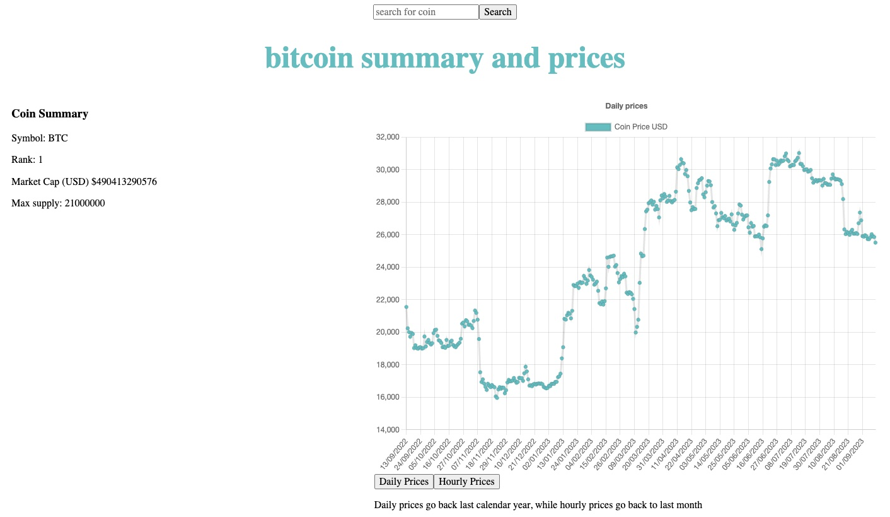

# Coincap Data Visualisation

## Overview

[Hosted link - Netlify](https://react-coincap-dataviz.netlify.app/)

A React app which provides responsive graphs of crypto coin prices from the [Coincap API](https://docs.coincap.io/). Graphs and visualisation are from chartJs and react-chartjs-2

## Functionality

-   Search by coin name in search bar which updates the daily coin prices for last (trailing) calendar year
-   Add functionality to change the time series
-   Add additional interactivity
-   Host front end

## Stack:

-   Vite:
    -   React
    -   TypeScript
-   chartJS & react-chartjs-2

## Installation (on local machine)

-   Clone repo
-   CD into repo folder and then run `npm install`
-   Run dev environment by running `npm run dev`, then `o` to open localhost environment

## Change logs

### 07/09/2023 - Initial commit, added MVP

-   Added line chart for daily prices
-   Added Fetch API service with search functionality

### 08/09/2023 - Updates to README

-   Added project status and updates to README for functionality and stack

### 11/09/23 - Added styling and coin summary

-   Added new API fetch for coin summary (market cap, rank, max supply)
-   Added new inline styling
-   Added button option for hourly and daily prices

### 12/09/23 - Added screenshot and deployed link
